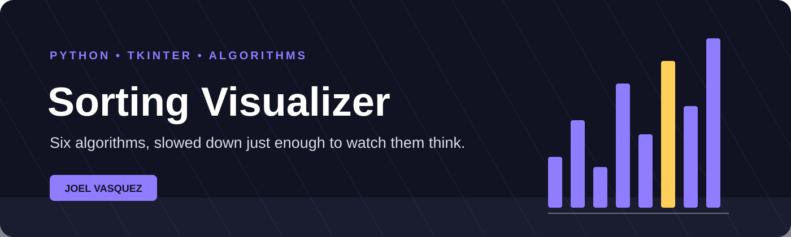

<div align="center">
  
</div>

<div align="center">

# Sorting Algorithm Visualizer

**Six classic algorithms, slowed down just enough to watch them think.**

A desktop visualizer for exploring how sorting algorithms move data, compare
values, and trade elegant theory for very visible real-world behavior.


</div>

## What it is

The Sorting Algorithm Visualizer renders an array as vertical bars and animates
every comparison, swap, pivot, and completed region. It is built as one
dependency-free Python desktop application using Tkinter.

The animation runs in a background thread so the interface remains responsive.
Pause, resume, reset, and speed controls stay usable while an algorithm is
working.

## Algorithms

| Algorithm | Typical time | Extra space | What the animation reveals |
|---|---:|---:|---|
| Bubble sort | O(n²) | O(1) | Large values repeatedly drift right |
| Selection sort | O(n²) | O(1) | Each pass searches for one minimum |
| Insertion sort | O(n²) | O(1) | A sorted prefix grows one value at a time |
| Merge sort | O(n log n) | O(n) | Halves split, then merge in order |
| Quick sort | O(n log n) average | O(log n) | A pivot partitions the active range |
| Heap sort | O(n log n) | O(1) | A max heap repeatedly exposes the next value |

## More than colored bars

- Generate random arrays at configurable sizes
- Enter custom values
- Adjust animation speed
- Pause and resume an active run
- Track comparisons, swaps, algorithm time, and animation time
- Highlight compared values, pivots, and completed positions
- Compare two algorithms using the same original array
- Separate pure algorithm timing from deliberate animation delays
- Review plain-language algorithm information in the interface

## Fair comparison mode

After one run, choose another algorithm and press **Compare**. The visualizer
restores the same unsorted input before the second run, then presents both
results side by side.

Pure execution time is measured using non-animated implementations. That keeps
`sleep()` calls and drawing work from masquerading as algorithm performance.

## Run it

Tkinter ships with most standard Python installations.

```bash
git clone https://github.com/jguapp/sorting-algorithm-visualizer.git
cd sorting-algorithm-visualizer
python sorting_visualizer.py
```

If Tkinter is missing on Linux, install the package provided by your
distribution, commonly `python3-tk`.

## How it is organized

The project intentionally lives in one readable file:

```text
sorting_visualizer.py
├── interface and controls
├── drawing and animation
├── threading, pause, and reset state
├── six animated algorithms
├── six timing-only implementations
└── comparison results window
```

## Status

The six algorithms, custom input, controls, statistics, and comparison workflow
are implemented. A useful next step is a screenshot or short GIF committed to
the repository so the visual project can introduce itself visually.

---

<div align="center">
Built by <a href="https://github.com/jguapp">Joel Vasquez</a>
</div>

